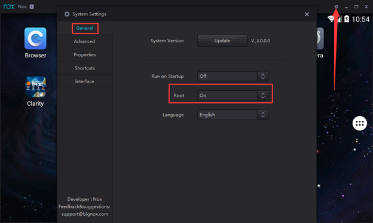
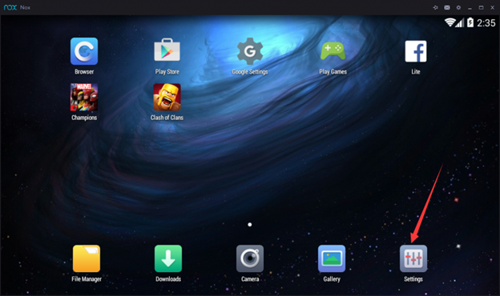
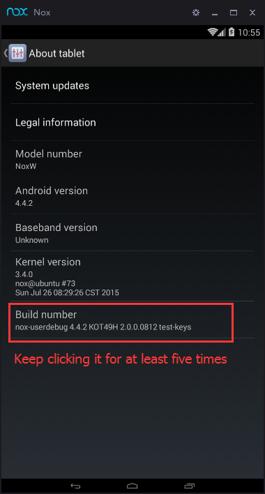
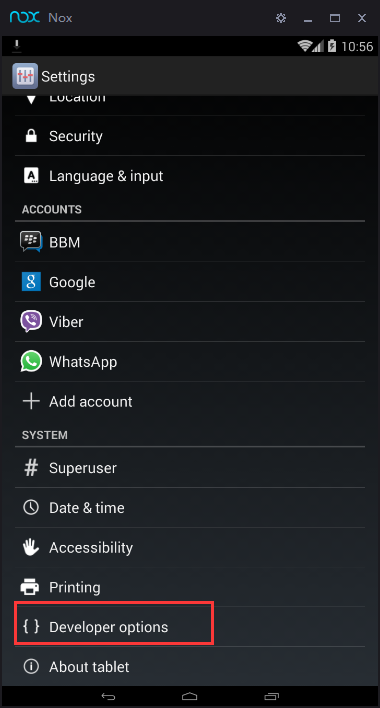
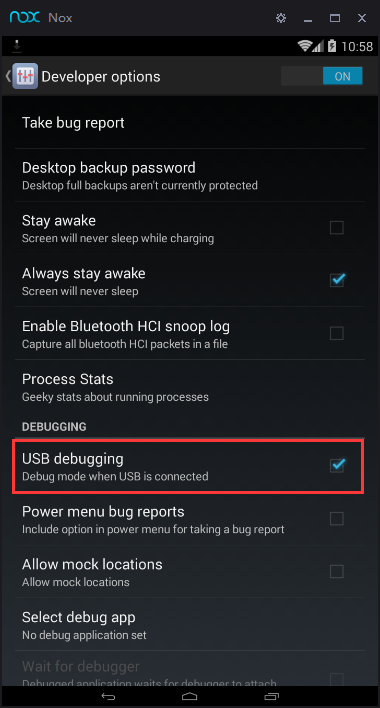
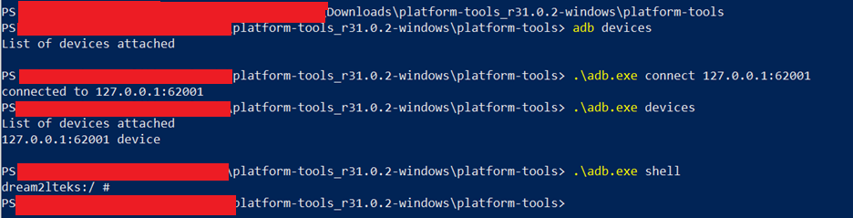
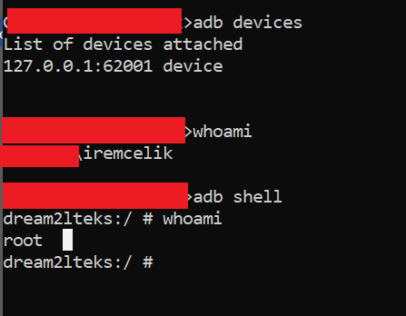

## How to connect Nox App Player for Android testing
Nox App Player is a full feature Android emulator which could be used for Android development, testing, and debugging. This post will give a step by step guidance on how to connect Nox with Android Studio as an example. 
1. Download and install the latest version of Nox App Player from our official website: https://www.bignox.com/
2. Start Android studio and create a new activity
3. Start Nox App Player, go to Nox system settings >> turn root mode on >> save changes and restart Nox
Note: Nox is defaulted to start in tablet mode, you could choose in System Settings >> Advanced >> Startup Setting >> Phone to better emulate the Android phone experience

4. Go to Android settings in Nox >> About Tablet >> Keep clicking Build number until it shows that you are now a developer >> go back to Android settings and you will find the developer options now.

5. Go to developer options >> tick USB debugging(I did not set this item.)

6. Now in Powershell, follow below steps. Then, re-start Nox.

7. Now adb shell will detect Nox.

